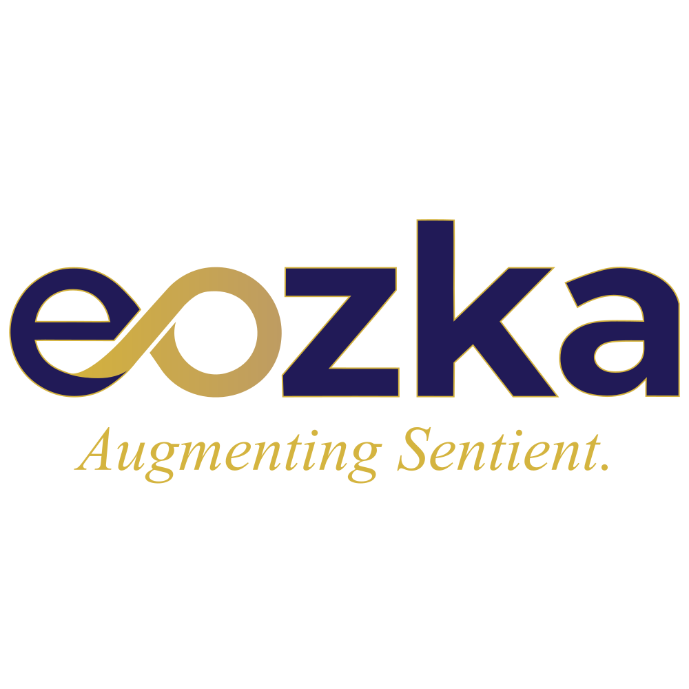
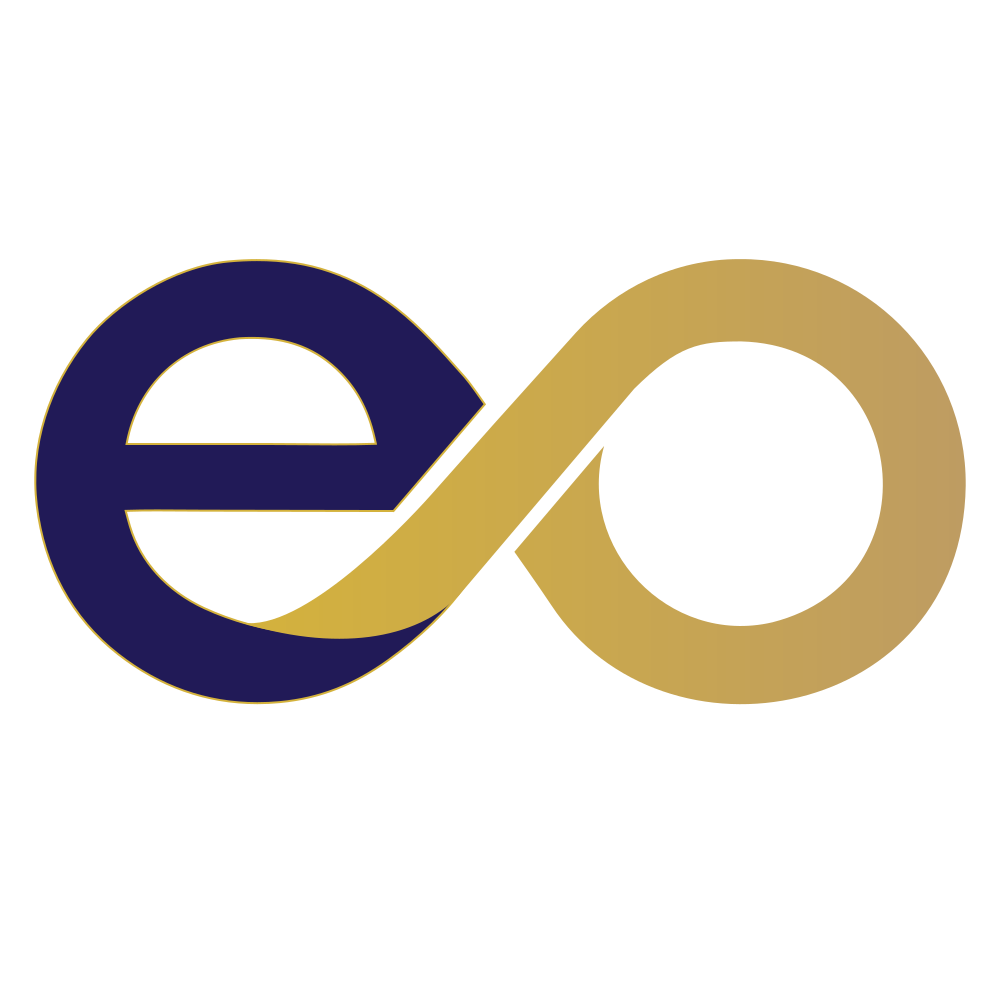

<!-- 

  

 -->

<h1 align="center"><b> AUGMENTING SENTIENT </b></h1>

<h3 align="center">Building the Future of Modular Operations</h3>

  <strong>eOzka</strong> is an operational holding company and software engineering ecosystem. We partner with builders to co-develop production-grade systems, providing core infrastructure engineering, technical advisory, and institutional governance frameworks to scale operations from inception.

  Our engineering tracks are anchored in strict type safety, local-first data privacy, and high-performance telemetry. While our core systems are proprietary, select community-facing repositories are open-source and licensed under the Apache License 2.0.

  Explore our projects and documentation at <a href="https://eozka.com" target="_blank">eOzka.com</a> and <a href="https://github.com/eOzkull/.github/wiki" target="_blank">Our Wiki.</a>

  
  &nbsp;&nbsp;
  
  &nbsp;&nbsp;
  
  &nbsp;&nbsp;
  
  

  
  &nbsp;&nbsp;
  
  

---

  
  &nbsp;&nbsp;&nbsp;&nbsp;&nbsp;&nbsp;&nbsp;&nbsp;&nbsp;&nbsp;&nbsp;&nbsp;&nbsp;&nbsp;&nbsp;&nbsp;
  
   
  <i><b>Managed by the eOzka Engineering Team.</b></i>

<!--

## Hi there 👋
**Here are some ideas to get you started:**

🙋‍♀️ A short introduction - what is your organization all about?
🌈 Contribution guidelines - how can the community get involved?
👩‍💻 Useful resources - where can the community find your docs? Is there anything else the community should know?
🍿 Fun facts - what does your team eat for breakfast?
🧙 Remember, you can do mighty things with the power of [Markdown](https://docs.github.com/github/writing-on-github/getting-started-with-writing-and-formatting-on-github/basic-writing-and-formatting-syntax)
-->